# Guía de trabajos prácticos de VHDL

Esta carpeta contiene implementaciones combinacionales y secuenciales realizadas
en VHDL. Para cada circuito se desarrolló un testbench en VHDL y una prueba
equivalente en Cocotb. Las simulaciones se ejecutan con GHDL y producen archivos
VCD y capturas PNG con los puertos de entrada y salida del nivel superior.

Los ejercicios corresponden a la [Guía de VHDL](docs/Guia_VHDL.pdf) de la
materia **Circuitos Lógicos Programables**, Especialización en Sistemas
Embebidos. La guía contiene 18 ejercicios distribuidos en cuatro páginas.

La documentación presenta para cada ejercicio la declaración de la entidad, una
descripción de su funcionamiento, el acceso al código fuente, los testbenches en
VHDL y Cocotb, y el resultado gráfico de la simulación.

## Estructura

- [`CLP_CESE.srcs/sources_1/new`](CLP_CESE/CLP_CESE.srcs/sources_1/new): entidades VHDL.
- [`CLP_CESE.srcs/sim_1/new`](CLP_CESE/CLP_CESE.srcs/sim_1/new): testbenches VHDL.
- [`cocotb`](cocotb): entorno reproducible de verificación con Cocotb, GHDL y Docker.
- [`cocotb/waveforms`](cocotb/waveforms): formas de onda VCD.
- [`cocotb/waveforms/png`](cocotb/waveforms/png): capturas de las simulaciones.

## Ejecución de las pruebas

Desde `Guia_TP/cocotb`:

```sh
docker compose build
docker compose run --rm cocotb python run_all.py
```

La suite ejecuta los 18 circuitos verificados. Cada prueba reproduce la secuencia
de su testbench VHDL, comprueba automáticamente las salidas y mantiene la
simulación activa 100 ns adicionales para facilitar la lectura del waveform.

Para regenerar las imágenes a partir de los VCD:

```sh
python generate_waveform_pngs.py
```

## Ejercicios

### Ejercicio 1 - Sumador completo de 1 bit

Implementa `a + b + ci` y entrega el bit de suma `s` y el acarreo `co`.

```vhdl
entity adder_1_bit is
    Port ( ci : in  STD_LOGIC;
           a  : in  STD_LOGIC;
           b  : in  STD_LOGIC;
           s  : out STD_LOGIC;
           co : out STD_LOGIC);
end adder_1_bit;
```

[Fuente](CLP_CESE/CLP_CESE.srcs/sources_1/new/adder_1_bit.vhd) ·
[Testbench VHDL](CLP_CESE/CLP_CESE.srcs/sim_1/new/adder_1_bit_tb.vhd) ·
[Test Cocotb](cocotb/test_adder_1_bit.py) ·
[VCD](cocotb/waveforms/adder_1_bit.vcd)

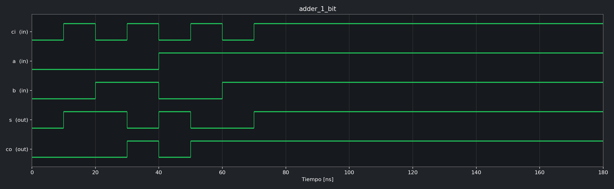

### Ejercicio 2 - Sumador completo estructural de 4 bits

Se construye interconectando cuatro instancias del sumador de 1 bit mediante una
cadena de acarreos.

```vhdl
entity adder_4_bits is
    Port ( ci : in  STD_LOGIC;
           a  : in  STD_LOGIC_VECTOR(3 downto 0);
           b  : in  STD_LOGIC_VECTOR(3 downto 0);
           s  : out STD_LOGIC_VECTOR(3 downto 0);
           co : out STD_LOGIC);
end adder_4_bits;
```

[Fuente](CLP_CESE/CLP_CESE.srcs/sources_1/new/adder_4_bits.vhd) ·
[Testbench VHDL](CLP_CESE/CLP_CESE.srcs/sim_1/new/adder_4_bit_tb.vhd) ·
[Test Cocotb](cocotb/test_adder_4_bits.py) ·
[VCD](cocotb/waveforms/adder_4_bits.vcd)

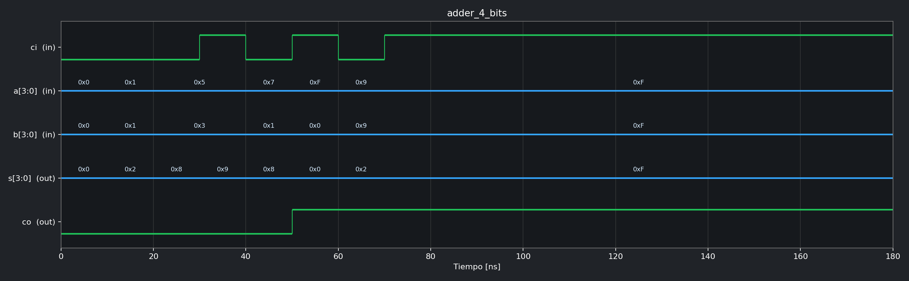

### Ejercicio 3 - Sumador/restador de 4 bits

`sr='0'` selecciona suma. Con `sr='1'` se complementa `b` y se utiliza el
acarreo de entrada para efectuar la resta en complemento a dos.

```vhdl
entity sum_res_4_bits is
    Port ( sr : in  STD_LOGIC;
           a  : in  STD_LOGIC_VECTOR(3 downto 0);
           b  : in  STD_LOGIC_VECTOR(3 downto 0);
           s  : out STD_LOGIC_VECTOR(3 downto 0);
           co : out STD_LOGIC);
end sum_res_4_bits;
```

[Fuente](CLP_CESE/CLP_CESE.srcs/sources_1/new/sum_res_4_bits.vhd) ·
[Testbench VHDL](CLP_CESE/CLP_CESE.srcs/sim_1/new/sum_res_4_bits_tb.vhd) ·
[Test Cocotb](cocotb/test_sum_res_4_bits.py) ·
[VCD](cocotb/waveforms/sum_res_4_bits.vcd)

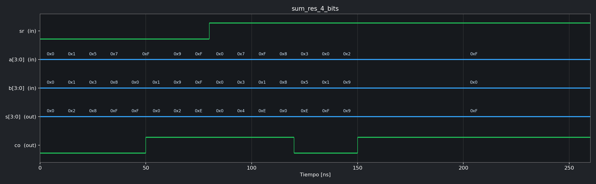

### Ejercicio 4 - Multiplexor 2 a 1

```vhdl
entity mux_2_a_1 is
    Port ( a   : in  STD_LOGIC;
           b   : in  STD_LOGIC;
           sel : in  STD_LOGIC;
           mux : out STD_LOGIC);
end mux_2_a_1;
```

[Fuente](CLP_CESE/CLP_CESE.srcs/sources_1/new/mux_2_a_1.vhd) ·
[Testbench VHDL](CLP_CESE/CLP_CESE.srcs/sim_1/new/mux_2_a_1_tb.vhd) ·
[Test Cocotb](cocotb/test_mux_2_a_1.py) ·
[VCD](cocotb/waveforms/mux_2_a_1.vcd)

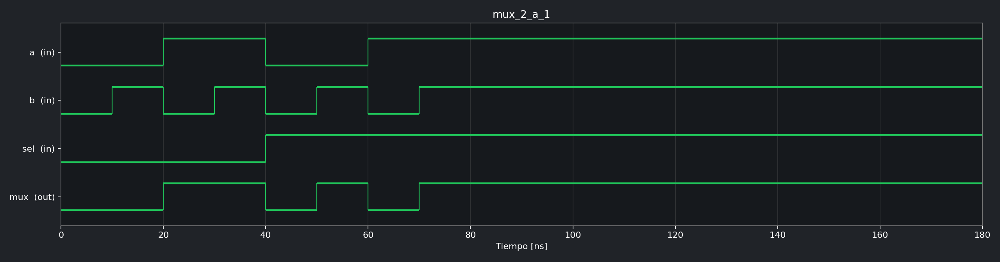

### Ejercicio 5 - Flip-flop D con reset y habilitación

El dato se almacena en el flanco ascendente cuando `ena='1'`. El reset es
síncrono.

```vhdl
entity ffd is
    Port (d   : in  STD_LOGIC;
          ena : in  STD_LOGIC;
          rst : in  STD_LOGIC;
          clk : in  STD_LOGIC;
          q   : out STD_LOGIC);
end ffd;
```

[Fuente](CLP_CESE/CLP_CESE.srcs/sources_1/new/ffd.vhd) ·
[Testbench VHDL](CLP_CESE/CLP_CESE.srcs/sim_1/new/ffd_tb.vhd) ·
[Test Cocotb](cocotb/test_ffd.py) · [VCD](cocotb/waveforms/ffd.vcd)

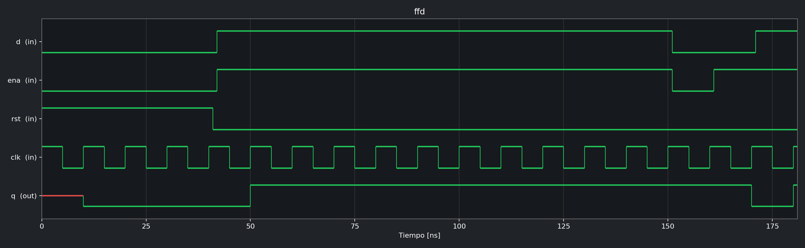

### Ejercicio 6 - Registro de desplazamiento estructural

Registro SISO de 4 bits construido con cuatro instancias de `ffd`.

```vhdl
entity reg_desp_estructural is
    Port (E   : in  STD_LOGIC;
          S   : out STD_LOGIC;
          rst : in  STD_LOGIC;
          clk : in  STD_LOGIC);
end reg_desp_estructural;
```

[Fuente](CLP_CESE/CLP_CESE.srcs/sources_1/new/reg_desp_estructural.vhd) ·
[Testbench VHDL](CLP_CESE/CLP_CESE.srcs/sim_1/new/reg_desp_estructural_tb.vhd) ·
[Test Cocotb](cocotb/test_reg_desp_estructural.py) ·
[VCD](cocotb/waveforms/reg_desp_estructural.vcd)

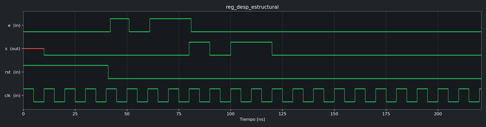

### Ejercicio 7 - Registro de desplazamiento por comportamiento

Describe el mismo registro SISO con un único proceso secuencial.

```vhdl
entity reg_desp_comportamiento is
    Port (E   : in  STD_LOGIC;
          S   : out STD_LOGIC;
          rst : in  STD_LOGIC;
          clk : in  STD_LOGIC);
end reg_desp_comportamiento;
```

[Fuente](CLP_CESE/CLP_CESE.srcs/sources_1/new/reg_desp_comportamiento.vhd) ·
[Testbench VHDL](CLP_CESE/CLP_CESE.srcs/sim_1/new/reg_desp_comportamiento_tb.vhd) ·
[Test Cocotb](cocotb/test_reg_desp_comportamiento.py) ·
[VCD](cocotb/waveforms/reg_desp_comportamiento.vcd)

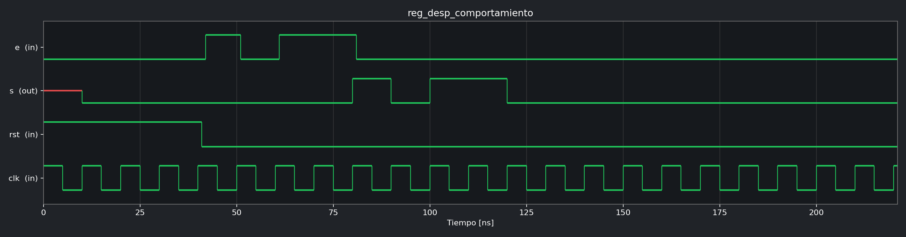

### Ejercicio 8 - Barrel shifter genérico por comportamiento

Desplaza lógicamente hacia la derecha la palabra `a`. `des` indica la cantidad
de posiciones. Los valores predeterminados implementan una palabra de 8 bits.

```vhdl
entity barrel_shifter is
    Generic (N : integer := 8;
             M : integer := 3);
    Port (a   : in  STD_LOGIC_VECTOR(N-1 downto 0);
          des : in  STD_LOGIC_VECTOR(M-1 downto 0);
          s   : out STD_LOGIC_VECTOR(N-1 downto 0));
end barrel_shifter;
```

[Fuente](CLP_CESE/CLP_CESE.srcs/sources_1/new/barrel_shifter.vhd) ·
[Testbench VHDL](CLP_CESE/CLP_CESE.srcs/sim_1/new/barrel_shifter_tb.vhd) ·
[Test Cocotb](cocotb/test_barrel_shifter.py) ·
[VCD](cocotb/waveforms/barrel_shifter.vcd)

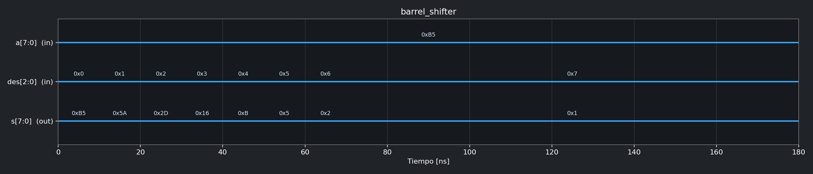

### Ejercicio 9 - Barrel shifter estructural con multiplexores

Implementación fija de 8 bits organizada en etapas de desplazamiento de 1, 2 y
4 posiciones, seleccionadas mediante multiplexores 2 a 1.

```vhdl
entity barrel_shifter_mux is
    Port (a   : in  STD_LOGIC_VECTOR(7 downto 0);
          des : in  STD_LOGIC_VECTOR(2 downto 0);
          s   : out STD_LOGIC_VECTOR(7 downto 0));
end barrel_shifter_mux;
```

[Fuente](CLP_CESE/CLP_CESE.srcs/sources_1/new/barrel_shifter_mux.vhd) ·
[Testbench VHDL](CLP_CESE/CLP_CESE.srcs/sim_1/new/barrel_shifter_mux_tb.vhd) ·
[Test Cocotb](cocotb/test_barrel_shifter_mux.py) ·
[VCD](cocotb/waveforms/barrel_shifter_mux.vcd)

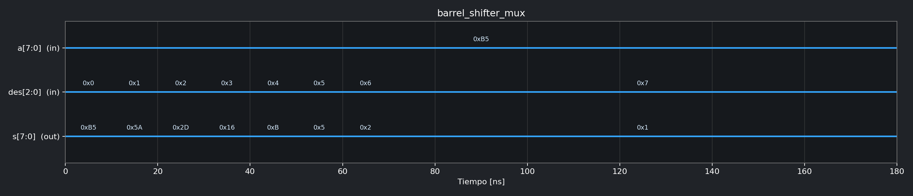

### Ejercicio 10 - Contador estructural de 4 bits

Se forma interconectando cuatro celdas unitarias. La habilitación se propaga
entre etapas y la salida avanza en binario cuando `ena='1'`.

```vhdl
entity contador_binario_4_bits is
    Port (ena : in  STD_LOGIC;
          rst : in  STD_LOGIC;
          clk : in  STD_LOGIC;
          q   : out STD_LOGIC_VECTOR(3 downto 0));
end contador_binario_4_bits;
```

[Fuente](CLP_CESE/CLP_CESE.srcs/sources_1/new/contador_binario_4_bits.vhd) ·
[Testbench VHDL](CLP_CESE/CLP_CESE.srcs/sim_1/new/contador_binario_4_bits_tb.vhd) ·
[Test Cocotb](cocotb/test_contador_binario_4_bits.py) ·
[VCD](cocotb/waveforms/contador_binario_4_bits.vcd)

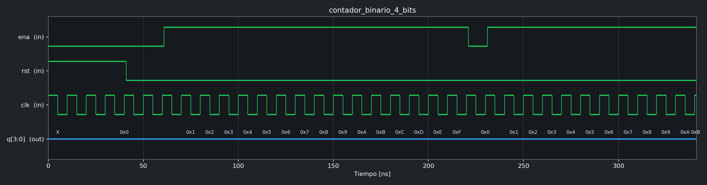

### Ejercicio 11 - Contador de 4 bits por comportamiento

```vhdl
entity contador_binario_4_bits_comportamiento is
    Port (ena : in  STD_LOGIC;
          rst : in  STD_LOGIC;
          clk : in  STD_LOGIC;
          q   : out STD_LOGIC_VECTOR(3 downto 0));
end contador_binario_4_bits_comportamiento;
```

[Fuente](CLP_CESE/CLP_CESE.srcs/sources_1/new/contador_binario_4_bits_comportamiento.vhd) ·
[Testbench VHDL](CLP_CESE/CLP_CESE.srcs/sim_1/new/contador_binario_4_bits_comportamiento_tb.vhd) ·
[Test Cocotb](cocotb/test_contador_binario_4_bits_comportamiento.py) ·
[VCD](cocotb/waveforms/contador_binario_4_bits_comportamiento.vcd)

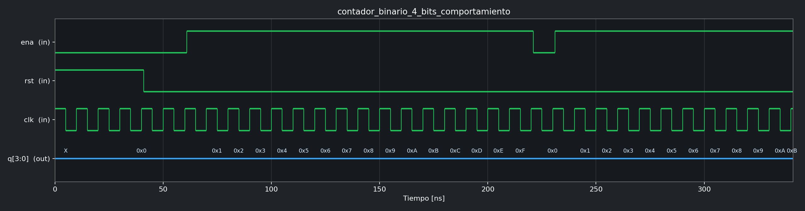

### Ejercicio 12 - Contador estructural genérico de N bits

El `for generate` instancia una celda unitaria por cada bit.

```vhdl
entity contador_binario_N_bits_estructural is
    Generic (N : integer := 4);
    Port (ena : in  STD_LOGIC;
          rst : in  STD_LOGIC;
          clk : in  STD_LOGIC;
          q   : out STD_LOGIC_VECTOR(N-1 downto 0));
end contador_binario_N_bits_estructural;
```

[Fuente](CLP_CESE/CLP_CESE.srcs/sources_1/new/contador_binario_N_bits_estructural.vhd) ·
[Testbench VHDL](CLP_CESE/CLP_CESE.srcs/sim_1/new/contador_binario_N_bits_estructural_tb.vhd) ·
[Test Cocotb](cocotb/test_contador_binario_N_bits_estructural.py) ·
[VCD](cocotb/waveforms/contador_binario_N_bits_estructural.vcd)

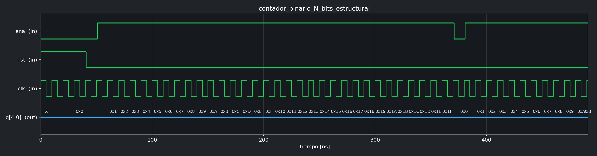

### Ejercicio 13 - Contador genérico de N bits por comportamiento

```vhdl
entity contador_binario_N_bits_comportamiento is
    Generic (N : integer := 4);
    Port (ena : in  STD_LOGIC;
          rst : in  STD_LOGIC;
          clk : in  STD_LOGIC;
          q   : out STD_LOGIC_VECTOR(N-1 downto 0));
end contador_binario_N_bits_comportamiento;
```

[Fuente](CLP_CESE/CLP_CESE.srcs/sources_1/new/contador_binario_N_bits_comportamiento.vhd) ·
[Testbench VHDL](CLP_CESE/CLP_CESE.srcs/sim_1/new/contador_binario_N_bits_comportamiento_tb.vhd) ·
[Test Cocotb](cocotb/test_contador_binario_N_bits_comportamiento.py) ·
[VCD](cocotb/waveforms/contador_binario_N_bits_comportamiento.vcd)

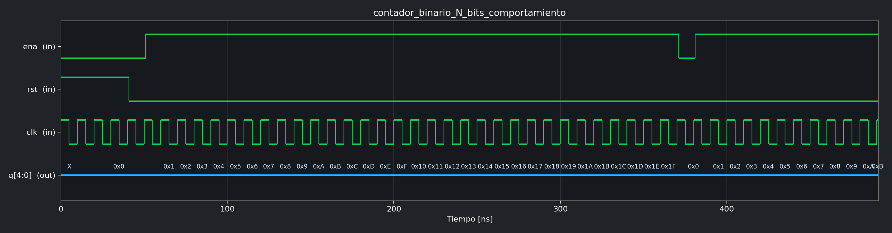

### Ejercicio 14 - Contador BCD estructural de un dígito

Utiliza un sumador de 4 bits como incrementador, un comparador genérico cargado
con 9 y un registro genérico de 4 bits. `co` indica el fin de cuenta del dígito.

```vhdl
entity contador_bcd is
    Port (ena : in  STD_LOGIC;
          rst : in  STD_LOGIC;
          clk : in  STD_LOGIC;
          q   : out STD_LOGIC_VECTOR(3 downto 0);
          co  : out STD_LOGIC);
end contador_bcd;
```

[Fuente](CLP_CESE/CLP_CESE.srcs/sources_1/new/contador_bcd.vhd) ·
[Testbench VHDL](CLP_CESE/CLP_CESE.srcs/sim_1/new/contador_bcd_tb.vhd) ·
[Test Cocotb](cocotb/test_contador_bcd.py) ·
[VCD](cocotb/waveforms/contador_bcd.vcd)

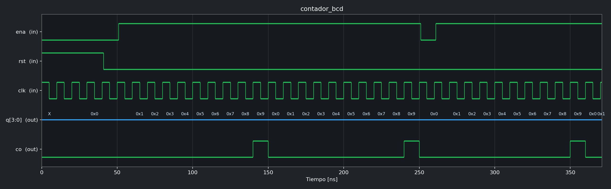

### Ejercicio 15 - Contador BCD por comportamiento

Implementa la cuenta de 0 a 9 y el retorno a cero mediante lógica combinacional
y un proceso secuencial para el registro.

```vhdl
entity contador_bcd_comportamiento is
    Port (ena : in  STD_LOGIC;
          rst : in  STD_LOGIC;
          clk : in  STD_LOGIC;
          q   : out STD_LOGIC_VECTOR(3 downto 0));
end contador_bcd_comportamiento;
```

[Fuente](CLP_CESE/CLP_CESE.srcs/sources_1/new/contador_bcd_comportamiento.vhd) ·
[Testbench VHDL](CLP_CESE/CLP_CESE.srcs/sim_1/new/contador_bcd_comportamiento_tb.vhd) ·
[Test Cocotb](cocotb/test_contador_bcd_comportamiento.py) ·
[VCD](cocotb/waveforms/contador_bcd_comportamiento.vcd)

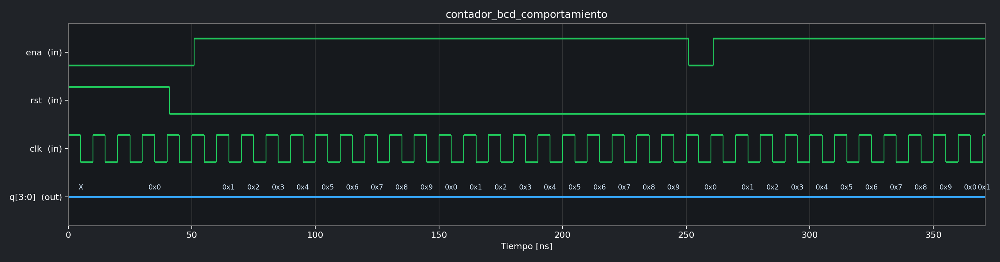

### Ejercicio 16 - Contador BCD de 4 dígitos

Instancia cuatro contadores BCD y encadena la habilitación de cada dígito con el
fin de cuenta del dígito anterior. Cuenta desde `0000` hasta `9999`.

```vhdl
entity contador_bcd_4_digitos is
    Port (ena  : in  STD_LOGIC;
          rst  : in  STD_LOGIC;
          clk  : in  STD_LOGIC;
          bcd0 : out STD_LOGIC_VECTOR(3 downto 0);
          bcd1 : out STD_LOGIC_VECTOR(3 downto 0);
          bcd2 : out STD_LOGIC_VECTOR(3 downto 0);
          bcd3 : out STD_LOGIC_VECTOR(3 downto 0);
          co   : out STD_LOGIC);
end contador_bcd_4_digitos;
```

[Fuente](CLP_CESE/CLP_CESE.srcs/sources_1/new/contador_bcd_4_digitos.vhd) ·
[Testbench VHDL](CLP_CESE/CLP_CESE.srcs/sim_1/new/contador_bcd_4_digitos_tb.vhd) ·
[Test Cocotb](cocotb/test_contador_bcd_4_digitos.py) ·
[VCD](cocotb/waveforms/contador_bcd_4_digitos.vcd)

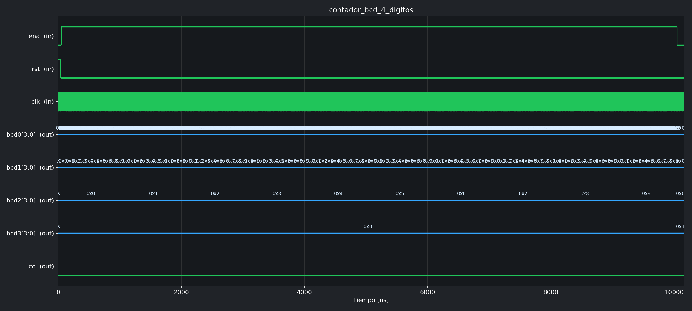

### Ejercicio 17 - Generador de habilitación cada N ciclos

La salida `s` permanece activa durante un ciclo de reloj cada `N` ciclos.

```vhdl
entity contador_N_clk is
    Generic (N : integer := 5);
    Port (rst : in  STD_LOGIC;
          clk : in  STD_LOGIC;
          s   : out STD_LOGIC);
end contador_N_clk;
```

[Fuente](CLP_CESE/CLP_CESE.srcs/sources_1/new/contador_N_clk.vhd) ·
[Testbench VHDL](CLP_CESE/CLP_CESE.srcs/sim_1/new/contador_N_clk_tb.vhd) ·
[Test Cocotb](cocotb/test_contador_N_clk.py) ·
[VCD](cocotb/waveforms/contador_N_clk.vcd)

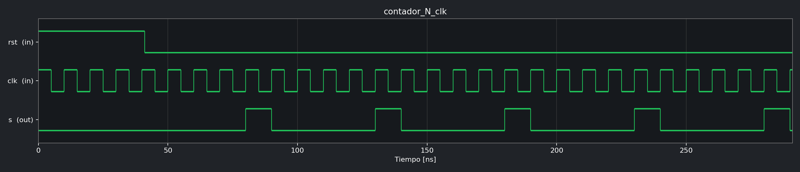

### Ejercicio 18 - Contador BCD con avance cada segundo

Top level que combina el generador de habilitación con el contador BCD. En el
hardware, `SYS_CLK` representa la frecuencia del reloj del sistema; durante la
simulación se reemplaza por un valor pequeño para evitar millones de ciclos.

```vhdl
entity contador_bcd_1_seg is
    Generic (SYS_CLK : integer := 100000000);
    Port (ena : in  STD_LOGIC;
          rst : in  STD_LOGIC;
          clk : in  STD_LOGIC;
          q   : out STD_LOGIC_VECTOR(3 downto 0));
end contador_bcd_1_seg;
```

[Fuente](CLP_CESE/CLP_CESE.srcs/sources_1/new/contador_bcd_1_seg.vhd) ·
[Testbench VHDL](CLP_CESE/CLP_CESE.srcs/sim_1/new/contador_bcd_1_seg_tb.vhd) ·
[Test Cocotb](cocotb/test_contador_bcd_1_seg.py) ·
[VCD](cocotb/waveforms/contador_bcd_1_seg.vcd)

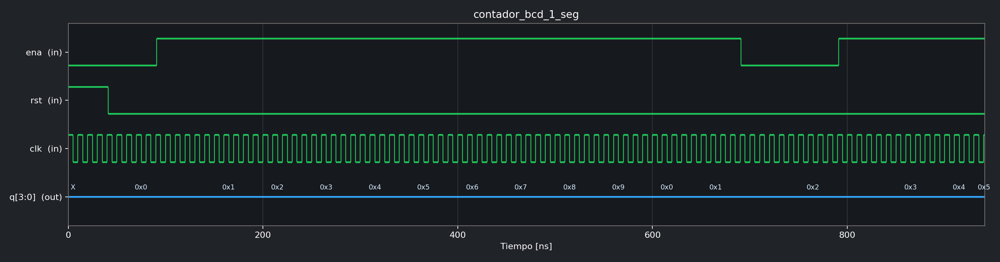

## Componentes auxiliares

Estos bloques se verifican indirectamente a través de los circuitos estructurales
que los instancian.

### Celda unitaria del contador binario

```vhdl
entity celda_unitaria_contador_binario is
    Port (ena_in  : in  STD_LOGIC;
          rst     : in  STD_LOGIC;
          clk     : in  STD_LOGIC;
          q       : out STD_LOGIC;
          ena_out : out STD_LOGIC);
end celda_unitaria_contador_binario;
```

[Fuente](CLP_CESE/CLP_CESE.srcs/sources_1/new/celda_unitaria_contador_binario.vhd)

### Comparador genérico

```vhdl
entity comparador_igual is
    Generic (N : integer := 4);
    Port (a     : in  STD_LOGIC_VECTOR(N-1 downto 0);
          b     : in  STD_LOGIC_VECTOR(N-1 downto 0);
          igual : out STD_LOGIC);
end comparador_igual;
```

[Fuente](CLP_CESE/CLP_CESE.srcs/sources_1/new/comparador_igual.vhd)

### Registro genérico

```vhdl
entity registro_N_bits is
    Generic (N : integer := 4);
    Port (d   : in  STD_LOGIC_VECTOR(N-1 downto 0);
          ena : in  STD_LOGIC;
          rst : in  STD_LOGIC;
          clk : in  STD_LOGIC;
          q   : out STD_LOGIC_VECTOR(N-1 downto 0));
end registro_N_bits;
```

[Fuente](CLP_CESE/CLP_CESE.srcs/sources_1/new/registro_N_bits.vhd)


